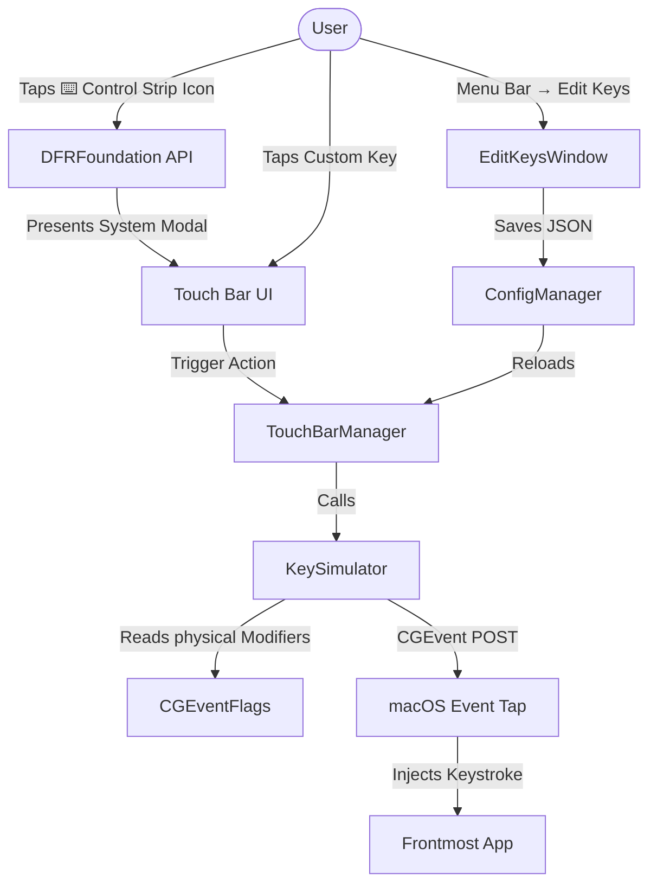

# bttopn

A minimal, free, open-source alternative to BetterTouchTool (BTT) — specifically designed for one main use case: replacing broken physical keyboard keys using custom Touch Bar buttons.

## Why this exists

If you're using a MacBook with a Touch Bar and some of your physical keyboard keys break, BetterTouchTool is the go-to solution to create functional replacement keys on your Touch Bar. However, BetterTouchTool is paid software, often bloated with features you might not need if you just want to fix a broken "A" key.

**bttopn** solves this single problem natively, efficiently, and for free.

## Features

- 🎹 **Custom Keys:** Add custom buttons to the Touch Bar that simulate keyboard key presses.
- 🔄 **Persistent:** Remains accessible at all times. A ⌨️ icon sits in your Control Strip; tap it to slide out your custom keys, without losing access to default volume/brightness controls.
- ⌨️ **Modifier Keys:** Reads the physical state of your keyboard. Hold `Cmd` + tap a Touch Bar button, and it triggers exactly as you'd expect.
- 📝 **JSON Config:** Easy to backup and configure via a local `keys.json` file.
- 🖱️ **Quick Edit UI:** Built-in macOS UI for adding/modifying keys on the fly.
- 🚀 **Lightweight:** Runs silently as a menu-bar-only App (no Dock icon) with virtually zero background CPU usage.

## Installation

1. Go to the [Releases](https://github.com/r69shabh/bttopn/releases) page and download `bttopn-latest.zip`.
2. Extract the archive and drag `bttopn.app` into your `/Applications` folder.
3. Open `bttopn.app`.

### Important: Accessibility Permissions
bttopn requires Accessibility permissions to simulate physical key presses (using `CGEvent`).
1. When you first launch the app, macOS will prompt you.
2. Go to **System Settings → Privacy & Security → Accessibility**.
3. Toggle the switch ON for **bttopn**.
*(Note: If you move the app after granting permission, macOS might quietly revoke it. You'll need to remove it from the list using the `-` button and add the new location).*

## Architecture & How It Works

Building a persistent Touch Bar app on modern macOS is tricky. Apple's public `NSTouchBar` API is strictly "contextual" — meaning it is scoped only to the currently active application. If you switch apps, your Touch Bar disappears.

To achieve persistence across all apps, **bttopn** uses the same architecture as MTMR (My TouchBar My Rules) and BetterTouchTool.

### How BetterTouchTool & bttopn work: Private APIs
We utilize the undocumented `DFRFoundation` private framework. Specifically:
1. `NSTouchBarItem.addSystemTrayItem` and `DFRElementSetControlStripPresenceForIdentifier` are used to inject our ⌨️ icon directly into the macOS Control Strip (next to Siri/Brightness).
2. `NSTouchBar.presentSystemModalTouchBar` is used to present the custom keys as a **System Modal Overlay**, meaning it renders *above* whatever the active application is requesting.
3. Once a Touch Bar button is tapped, `KeySimulator` uses `CGEvent(keyboardEventSource:virtualKey:keyDown:)` to broadcast a low-level HID event to the OS.

### System Flow Diagram



## Limitations

Because bttopn relies on private macOS APIs (`DFRFoundation`):
- **Not App Store Compatible:** Apple does not allow apps using private APIs on the Mac App Store.
- **macOS Updates:** While this method has remained stable since macOS 10.14, major future updates could potentially break the `DFR` framework.
- **Gestures:** Unlike BTT, bttopn does not support sliders, two-finger gestures, or complex UI components in the Touch Bar. It is strictly for keys.

## Configuration

You can configure your keys effortlessly via the **Menu Bar** (click the ⌨️ icon at the top of your screen) and select **Edit Keys...**.

If you prefer editing files, the configuration lives at:
`~/.config/bttopn/keys.json`

Format example:
```json
{
  "keys": [
    { "label": "9", "keyCode": 25 },
    { "label": "O", "keyCode": 31 },
    { "label": "L", "keyCode": 37 },
    { "label": ".", "keyCode": 47 },
    { "label": "-", "keyCode": 27 },
    { "label": "→", "keyCode": 124 }
  ]
}
```

## Build Instructions (For Developers)

To build bttopn from source, you do not even need Xcode. We provide a simple build script.

```bash
git clone https://github.com/r69shabh/bttopn.git
cd bttopn
chmod +x build.sh
./build.sh
```

Ensure you have the macOS SDK installed (via Xcode Command Line Tools).

## License

bttopn is completely open-source and free for personal use.
