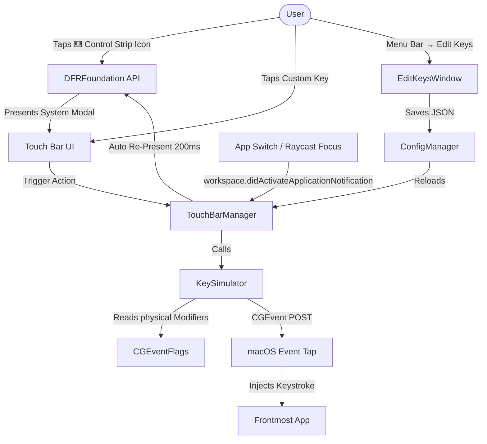

# 🎹 bttopn

<p align="center">
  <strong>A lightweight, 100% free, and open-source alternative to BetterTouchTool (BTT) for macOS.</strong><br />
  <em>Specifically engineered to customize your MacBook Touch Bar, map persistent custom keys, and seamlessly replace broken physical keys.</em>
</p>

<p align="center">
  
  
  
  
  
</p>

---

## 💡 Why bttopn?

If you use a MacBook with a Touch Bar and have physical keyboard keys that are broken or unresponsive, **BetterTouchTool (BTT)** is the standard recommendation for mapping replacement keys on your Touch Bar. However, BTT is paid proprietary software, often packed with complex features you might not need if you just want to regain typing functionality.

**bttopn** is built to solve this exact problem beautifully, natively, and with virtually **zero configuration or overhead**.

---

## ✨ Features

- 🎹 **Custom Overlay Keys:** Quickly add custom buttons to your Touch Bar that trigger any physical keyboard keystroke.
- 🔄 **Persistent Auto-Restore:** Automatically detects frontmost application switches. If you invoke **Raycast, Spotlight, Alfred**, or any launcher, **bttopn** keeps your custom keys active and visible without interruptions.
- ⌨️ **Physical Modifier State Sync:** Fully recognizes held physical modifier keys (`Cmd`, `Shift`, `Opt`, `Control`). Hold physical `Cmd` and tap your Touch Bar `Z` key to trigger `Cmd + Z`.
- 🎛️ **Seamless Control Strip Toggle:** A clean ⌨️ icon sits persistently in your Control Strip. Tap it to slide in your custom keys instantly; tap again to hide them and return to standard macOS actions.
- 🖱️ **Interactive GUI Editor:** Built-in native macOS window for managing, ordering, and adding new keys in seconds.
- 🚀 **Ultra-lightweight:** Compiled natively in Swift. Hides from the Dock/App Switcher, running quietly in the menu bar with `0%` idle CPU usage and < `15MB` RAM footprint.

---

## ⚡ bttopn vs. BetterTouchTool (BTT)

| Feature | **bttopn** (Open Source) | **BetterTouchTool** (BTT) |
| :--- | :--- | :--- |
| **Cost** | 🆓 **100% Free & Open Source** | 💰 Paid ($10 – $22+) |
| **Footprint** | ⚡ Extremely light (`<15MB` RAM, `0%` idle CPU) | 📦 Heavier / Feature Rich |
| **Source Code** | 🔓 Fully Open Source (MIT License) | 🔒 Proprietary / Closed Source |
| **Broken Key Mapping**| ✅ Instant, out-of-the-box | ✅ Supported |
| **Raycast/Spotlight Sync**| 🔄 **Auto-Restores Touch Bar instantly** | ⚠️ Requires manual settings tweak |
| **Control Strip Integration**| ⌨️ Persistent togglable icon | ✅ Supported |
| **Complex Gestures/Sliders**| ❌ Removed to stay fast & lightweight | ✅ Supported |

---

## 🚀 Quick Start & Installation

### 1. Download and Install
1. Head over to the [Releases](https://github.com/r69shabh/bttopn/releases) page and download the latest `bttopn-vX.Y.Z.zip`.
2. Extract the ZIP archive.
3. Drag `bttopn.app` directly into your `/Applications` folder.
4. Double-click to launch.

### 2. Grant Accessibility Permissions
Because **bttopn** simulates low-level hardware keystrokes using Apple's `CGEvent` APIs, macOS requires Accessibility authorization:
1. Upon first launch, you will see a macOS permission request.
2. Open **System Settings → Privacy & Security → Accessibility**.
3. Toggle the switch **ON** for **bttopn**.
*(Note: If you move the app's location on disk, macOS may quietly revoke permissions. Simply remove it from the list using the `-` button and re-add it).*

---

## 🛠️ Architecture & Under the Hood

Apple's public `NSTouchBar` framework is strictly **context-sensitive**—meaning it only displays controls relevant to the active, focused app. When you switch applications, your custom Touch Bar vanishes.

To bypass this and achieve system-wide persistence, **bttopn** hooks into Apple's private `DFRFoundation` framework:

1. **Persistent System Tray Entry:** Uses `NSTouchBarItem.addSystemTrayItem` and `DFRElementSetControlStripPresenceForIdentifier` to mount a dedicated `⌨️` trigger directly in the Control Strip.
2. **System Modal Overlay:** Employs `NSTouchBar.presentSystemModalTouchBar` to elevate the custom keys to a high-priority system-modal overlay, rendering it above whatever Touch Bar layout the active app demands.
3. **App-Switch Interceptor:** Subscribes to `NSWorkspace.didActivateApplicationNotification`. When a launcher like Raycast steals window focus and overrides the Touch Bar, **bttopn** waits `200ms` (for the OS transition to settle) and programmatically re-asserts the system modal overlay.
4. **Keystroke Simulation:** Listens to the hardware keyboard's modifier state via `CGEventSource.flagsState(.hidSystemState)` and broadcasts synthetic key-down/key-up sequence events to the frontmost window using `CGEvent.post(tap: .cghidEventTap)`.

### System Flow Architecture



---

## ⚙️ Configuration

You can easily configure your keys through two different methods:

### Method A: Built-in GUI Editor (Recommended)
1. Click the `⌨️` icon in your macOS top **Menu Bar**.
2. Select **Edit Keys...** to open the interactive editor.
3. Add, edit, or remove mappings in real time!

### Method B: Manual JSON File Editing
If you prefer configuring via code or want to backup your settings, the configuration is stored in a clean JSON format:
📁 `~/.config/bttopn/keys.json`

```json
{
  "keys": [
    { "label": "9", "keyCode": 25 },
    { "label": "O", "keyCode": 31 },
    { "label": "L", "keyCode": 37 },
    { "label": ".", "keyCode": 47 },
    { "label": "-", "keyCode": 27 },
    { "label": "→", "keyCode": 124 }
  ]
}
```
*(Tip: Refer to `Sources/KeyCodes.swift` for a comprehensive list of standard macOS virtual keycodes).*

---

## 🧱 Local Compilation (For Contributors)

You do not even need Xcode to compile and build this project locally. A lightweight shell script compiles the Swift source files directly using the system command-line compiler:

```bash
# Clone the repository
git clone https://github.com/r69shabh/bttopn.git
cd bttopn

# Build the app bundle
chmod +x build.sh
./build.sh
```

**Prerequisites:** Requires macOS SDK and Swift Command Line Tools (available via `xcode-select --install`).

---

## ⚠️ Important Limitations

As **bttopn** relies on private Apple system frameworks (`DFRFoundation`):
- **Mac App Store:** It cannot be submitted to the official Mac App Store due to private API usage.
- **macOS Updates:** Apple may occasionally modify or deprecate undocumented system methods. While this mechanism has remained stable from macOS Mojave (10.14) up to macOS Sonoma/Sequoia (14/15), future OS iterations might require updates.
- **Scope Limit:** Unlike BTT, there is no support for complex multi-touch gestures, trackpad remapping, window snapping, or sliders. It remains strictly focused on lightning-fast Touch Bar key simulation.

---

## 📄 License & Contributing

- Distributed under the **MIT License**. See `LICENSE` for details.
- **Contributions are highly welcome!** Feel free to open issues for bug reports, suggest improvements, or submit pull requests.
